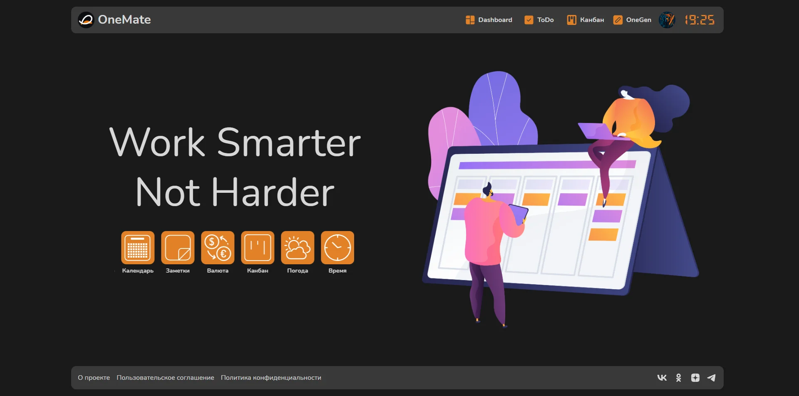
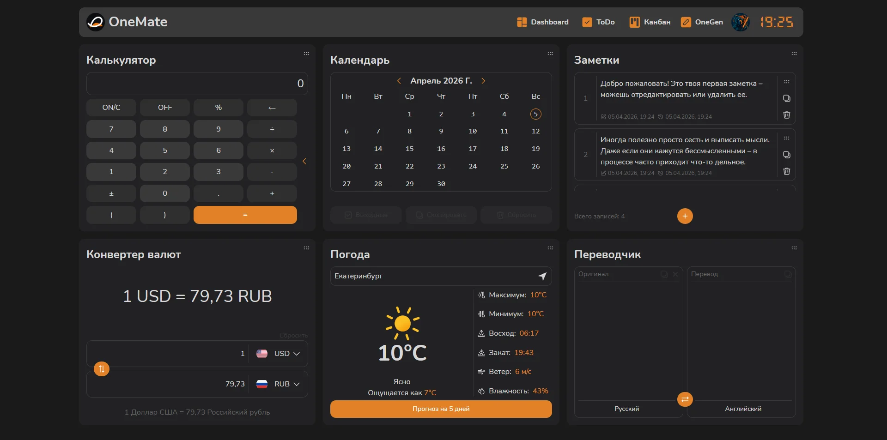
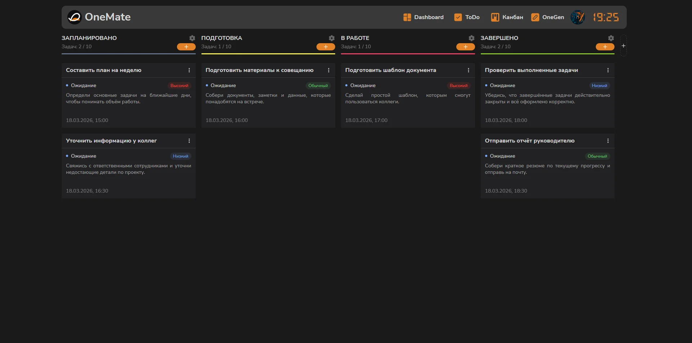
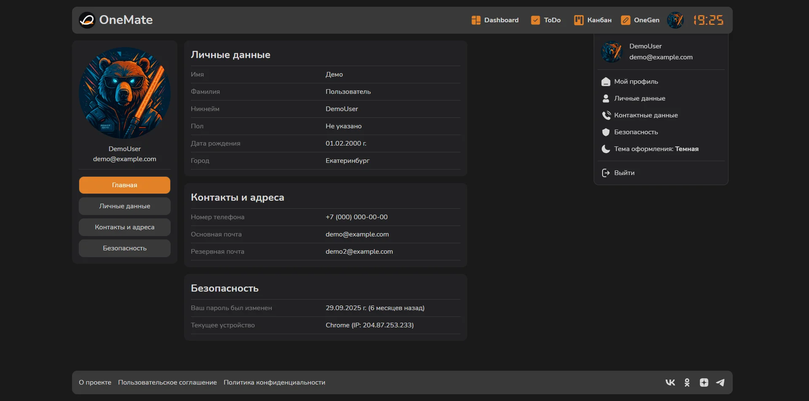

# OneMate – твое личное рабочее пространство

**OneMate** – современное веб-приложение, которое включает в себя многофункциональный виджет-хаб (калькулятор, календарь, заметки, конвертер валют, погода, переводчик), канбан-доску и удобный ToDo.

> [!IMPORTANT]
>
> Посмотреть проект в деле:
>
> 

## Технологический стек

### Frontend

- **React** + **TypeScript** – компонентная архитектура и строгая типизация;
- **FSD (Feature-Sliced Design)** – четкое разделение ответственности и масштабируемая структура;
- **Tailwind CSS** – единый визуальный стиль и быстрая адаптивная вёрстка;
- **MobX** – реактивное управление состоянием с лаконичным синтаксисом;
- **Vite** – быстрый запуск и оптимизированная сборка.

### Backend

- **Supabase** – быстрое развёртывание базы данных и аутентификации без отдельного backend.

### DevOps & Infrastructure

- **Docker** – контейнеризация приложений и унификация окружения;
- **Docker Compose** – управление многоконтейнерной инфраструктурой;
- **Nginx** – reverse proxy и раздача приложений;
- **VPS** – деплой и администрирование проекта.

## Возможности

- OAuth 2.0 (Google) и email-авторизация;
- адаптивный интерфейс для всех экранов и ориентаций (от iPhone SE 2016 до 2K-мониторов);
- кроссбраузерная совместимость с частичной поддержкой устаревающих технологий;
- светлая и тёмная тема;
- персональный профиль с аватаркой, личными и контактными данными;
- просмотр активных сессий и истории последних входов;
- смена пароля и удаление профиля;
- демо-режим для публичного доступа (GDPR-совместимый);
- политика конфиденциальности и пользовательское соглашение.

## Модули

**Dashboard** – набор из 6 встроенных мини-инструментов (виджетов) для повседневных задач.

- калькулятор с поддержкой истории вычислений;
- календарь с выбором, подсчётом и экспортом периодов;
- заметки с быстрым сохранением, удобным просмотром и drag & drop сортировкой;
- конвертер валют с экспортом курса и результатов конвертации;
- погода с определением местоположения и прогнозом на 5 дней;
- переводчик с широкой поддержкой языков.

**Kanban** – доска для визуального управления задачами и проектами.

- создание, удаление и сортировка задач и колонок с drag & drop;
- настройка внешнего вида доски и карточек (цвета, приоритеты, метки);
- минималистичный и современный интерфейс для управления задачами;
- синхронизация с базой данных для сохранения прогресса между сессиями.

## Скриншоты

  
Показать

   

    
     
    
     
    
     
    
  

## Автор

> [!TIP]
>
> #### Евгений Летунов
>
>  
