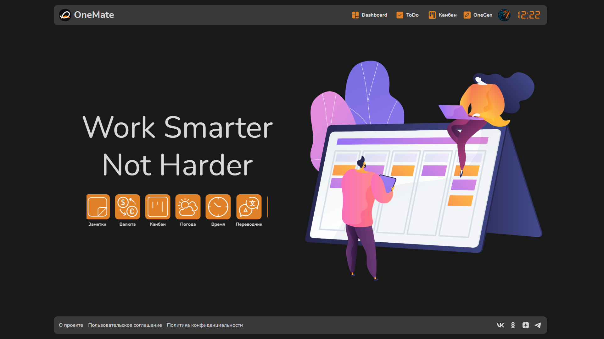
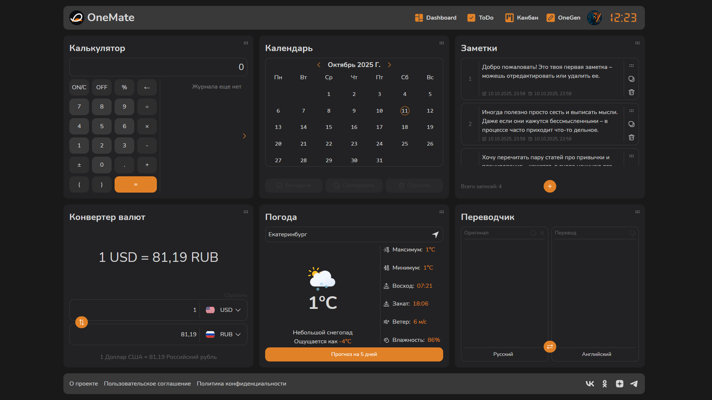
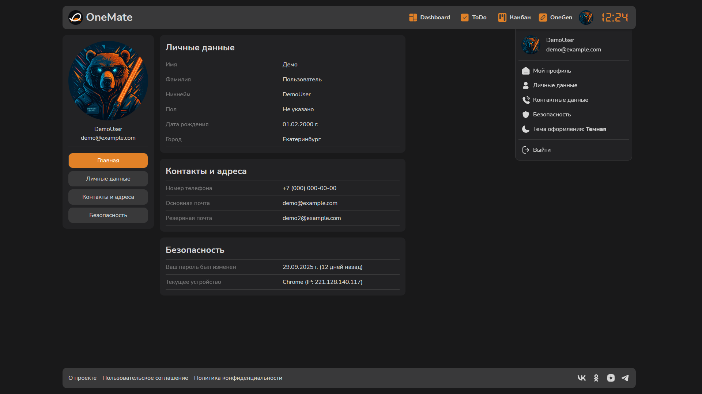

      

# OneMate – твое личное рабочее пространство

OneMate – это современное веб-приложение, которое включает в себя многофункциональный виджет-хаб (калькулятор, календарь, заметки, конвертер валют, погода, переводчик), канбан-доску и удобный ToDo.

## О проекте

**OneMate** – экспериментальная платформа (пет-проект), предназначенная для апробации современных инструментов, технологий и архитектурных подходов во фронтенд-разработке. Проект развивается как персональное настраиваемое рабочее пространство, ориентированное на удобство и эффективность пользователя.

> [!IMPORTANT]
> Посмотреть проект в деле:
>
> 
>
> Регистрация временно приостановлена. Воспользуйтесь демо-режимом («Войти как гость»).

## Технологический стек

В OneMate используется современный Frontend-стек технологий:

- **React** + **TypeScript** для удобной и предсказуемой разработки;
- **FSD (Feature-Sliced Design)** для создания модульного, масштабируемого и структурированного кода;
- **Tailwind CSS** для быстрого создания адаптивного интерфейса с акцентом на унификацию UI;
- **MobX** для реактивного управления состоянием приложения;
- **Vite** для оптимизированной сборки и ускоренного процесса разработки;
- **Supabase** для быстрого развертывания базы данных и систем аутентификации без необходимости в полноценном backend.

## Что внутри?

**Унифицированный UI на Tailwind с фокусом на UX:**

- OAuth 2.0 (Google) + Email авторизация;
- адаптивный дизайн (от iPhone SE 2016 до 2K мониторов) во всех ориентациях;
- кроссбраузерная совместимость с частичной поддержкой устаревающих технологий;
- приятный, современный интерфейс с возможностью выбора темы (dark/light mode).

**6 функциональных виджетов**:

- классический калькулятор с поддержкой истории вычислений;
- календарь с возможностью выбора, подсчета и экспорта периодов;
- заметки с быстрым сохранением, удобным просмотром и Drag & Drop сортировкой;
- конвертер валют с удобным экспортом текущего курса и результатов конвертации;
- погода с определением местоположения и прогнозом на ближайшие 5 дней;
- минималистичный переводчик с широкой поддержкой языков.

**Личный кабинет:**

- выбор любой из 16 красочных предустановленных аватарок;
- редактирование личных данных (ФИО, имя пользователя, дата рождения, пол, город);
- редактирование контактных данных (телефон, e-mail) с маской и автодобавлением полей;
- просмотр текущей сессии (устройство, город, IP-адрес), а также 10 последних входов;
- легкое управление аккаунтом: смена пароля и удаление профиля.

**Правовое обеспечение:**

- Демо-режим для публичного доступа (GDPR compliance);
- Прозрачная политика конфиденциальности;
- Понятное пользовательское соглашение.

## Скриншоты

  
Показать

   

    
     
    
     
    
  

## Автор

> [!TIP]
>
> #### Евгений Летунов
>
>  
